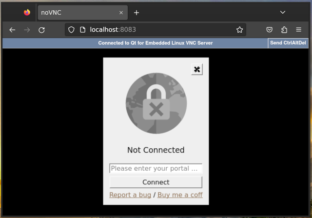
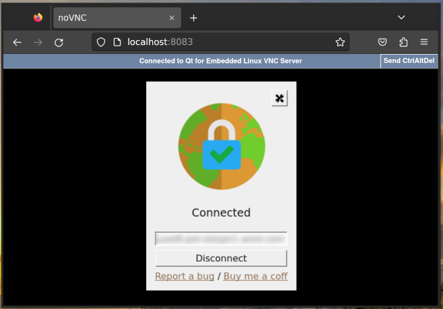
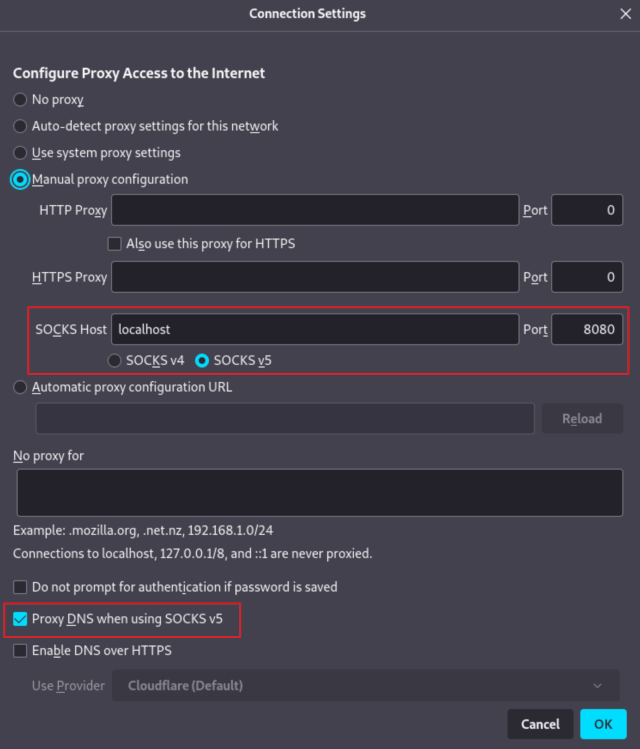

# GlobalProtect VPN client (GUI) in a Docker container

This is an implementation of GlobalProtect VPN client (GUI), which runs in a Docker container and exposes the VPN connection to the users as a SOCKS5 proxy.

Technically, the Docker container runs a fork of [GlobalProtect-openconnect](https://github.com/yuezk/GlobalProtect-openconnect), redesigned to come as a single executable, without client-server separation.



## Features

- Similar user experience as the official client in macOS.
- Supports both SAML and non-SAML authentication modes.
- Supports automatically selecting the preferred gateway from the multiple gateways.
- Supports switching gateway from the system tray menu manually.
- Memorizes credentials and authenticates automatically without a dialog.

# Docker
 
```
git clone --recurse-submodules https://github.com/RManLuo/globalprotect-docker.git
cd globalprotect-docker
docker-compose up -d
```
 
On the first run, navigate to `http://localhost:8083` in the web browser to provide authentication credentials. On subsequent invocations, the container will  try to use the cached credentials.

When the connection is established, configure your applications to use the provided SOCKS5 proxy (SOCKS5 Port: 10081 by default). For example, Firefox:



## Optional 1Password auto-reconnect

The container can reconnect automatically after an unexpected VPN disconnect by reading the login username, password, and TOTP from 1Password CLI. This is disabled by default and should be configured with local-only files.

### 1Password item requirements

Create a 1Password Login item that contains:

- `username`: your identity-provider username.
- `password`: your identity-provider password.
- One-time password/TOTP field: the same TOTP seed used by your authenticator app.

Create a 1Password service account with read-only access to only the vault that contains this item. Use the official [1Password service account setup guide](https://www.1password.dev/service-accounts/get-started) as the source of truth.

Recommended 1Password.com flow:

1. Sign in to 1Password.com and open the service account creation wizard from the Developer page.
2. Name the service account for this container, for example `globalprotect-docker`.
3. Grant access only to the vault that contains the VPN Login item.
4. Set the vault permissions to read-only item access. Do not grant write, share, or vault-creation permissions for this use case.
5. Create the service account and save the token immediately. 1Password only shows the token once.

The same can be done with 1Password CLI:

```bash
op service-account create "globalprotect-docker" --vault "<1password-vault-name-or-id>:read_items"
```

Service account vault access and permissions cannot be edited later; create a new service account if you need to change them. Store the service account token outside git:

```
mkdir -p .secrets
printf '%s' 'ops_...' > .secrets/op_service_account_token
chmod 600 .secrets/op_service_account_token
```

Never commit `.secrets/`, service account tokens, generated TOTP codes, VPN cookies, or real credentials.

### Local Compose override

Copy the committed example to an untracked local override file, then replace the placeholders:

```bash
cp docker-compose.auto-reconnect.example.yml docker-compose.auto-reconnect.yml
```

The local file should look like this:

```yaml
services:
  globalprotect:
    environment:
      - GPAGENT_AUTO_RECONNECT=1
      - GPAGENT_PORTAL=<vpn-portal-host>
      - GPAGENT_OP_ITEM=<1password-item-title-or-id>
      - GPAGENT_OP_VAULT=<1password-vault-name-or-id>
      - OP_SERVICE_ACCOUNT_TOKEN_FILE=/run/secrets/op_service_account_token
      - GPAGENT_LOGIN_USERNAME_SELECTOR=<username-input-css-selector>
      - GPAGENT_LOGIN_PASSWORD_SELECTOR=<password-input-css-selector>
      - GPAGENT_LOGIN_TOTP_SELECTOR=<totp-input-css-selector>
      - GPAGENT_LOGIN_SUBMIT_SELECTOR=<submit-button-css-selector>
      - GPAGENT_SAML_THROTTLE_SLEEP_SECONDS=300
    secrets:
      - op_service_account_token

secrets:
  op_service_account_token:
    file: ./.secrets/op_service_account_token
```

`GPAGENT_PORTAL` pre-fills the portal and starts the first connection attempt. The selectors must match your identity-provider login pages. Use browser developer tools in the noVNC window to inspect the username, password, TOTP, and submit controls. Common examples are `#username`, `input[name="identifier"]`, `input[type="password"]`, `input[autocomplete="one-time-code"]`, and `button[type="submit"]`.

Some identity providers show username, password, and TOTP on separate screens. In that case, keep all relevant selectors configured; the automation fills only the visible matching field on each page.

If the identity provider reports too many login attempts, the container waits for `GPAGENT_SAML_THROTTLE_SLEEP_SECONDS` seconds and restarts login from the beginning with a fresh prelogin request. The default is 300 seconds.

### Monash login template

For Monash GlobalProtect, `docker-compose.auto-reconnect.example.yml` already includes the current selector template. Keep the personal values as placeholders in git and fill them only in your local `docker-compose.auto-reconnect.yml`:

```yaml
services:
  globalprotect:
    environment:
      - GPAGENT_AUTO_RECONNECT=1
      - GPAGENT_PORTAL=vpn.gp.monash.edu
      - GPAGENT_OP_ITEM=<your-1password-item-title-or-id>
      - GPAGENT_OP_VAULT=<your-1password-vault-name-or-id>
      - OP_SERVICE_ACCOUNT_TOKEN_FILE=/run/secrets/op_service_account_token
      - GPAGENT_LOGIN_USERNAME_SELECTOR=input[name="identifier"]
      - GPAGENT_LOGIN_PASSWORD_SELECTOR=input[name="credentials.passcode"]
      - GPAGENT_LOGIN_TOTP_SELECTOR=input[name="credentials.passcode"]
      - GPAGENT_LOGIN_SUBMIT_SELECTOR=input[type="submit"]
      - GPAGENT_SAML_THROTTLE_SLEEP_SECONDS=60
    secrets:
      - op_service_account_token

secrets:
  op_service_account_token:
    file: ./.secrets/op_service_account_token
```

The password and TOTP pages both use `input[name="credentials.passcode"]`; the automation decides which value to fill based on the visible page context. If the identity-provider page changes or automation cannot find a field, open noVNC at `http://localhost:8083` and complete or inspect the login there.

### Verify 1Password access

Check the configured item before starting the container. Do not print the password or TOTP value in logs or issue reports.

```bash
export OP_SERVICE_ACCOUNT_TOKEN="$(cat .secrets/op_service_account_token)"
op item get "<1password-item-title-or-id>" --vault "<1password-vault-name-or-id>" --fields label=username --reveal
op item get "<1password-item-title-or-id>" --vault "<1password-vault-name-or-id>" --fields label=password --reveal | wc -c
op item get "<1password-item-title-or-id>" --vault "<1password-vault-name-or-id>" --otp | wc -c
```

The password command intentionally uses `--fields label=password --reveal`. Without `--reveal`, 1Password may return a concealed placeholder instead of the real password.

### Run with auto-login enabled

```
docker compose -f docker-compose.yml -f docker-compose.auto-reconnect.yml up -d --build
docker compose -f docker-compose.yml -f docker-compose.auto-reconnect.yml logs -f globalprotect
```

The VPN is ready when the logs show that `openconnect` established the tunnel and the SOCKS5 proxy is listening on `127.0.0.1:10081`. If login fails, inspect the noVNC window at `http://localhost:8083`, adjust the selectors in the local override, and restart the container.

## Optional connection modes

The Compose files are intentionally split by function so you can enable only the parts you need:

| File | Function |
| --- | --- |
| `docker-compose.auto-reconnect.example.yml` | Template for a local `docker-compose.auto-reconnect.yml` override that enables unattended 1Password login and reconnect. |
| `docker-compose.tailscale.example.yml` | Adds a Tailscale sidecar in the GlobalProtect network namespace so it can advertise selected VPN-private CIDRs to your tailnet. |
| `docker-compose.cloudflare.example.yml` | Adds a `cloudflared` sidecar in the GlobalProtect network namespace so Cloudflare One users can reach configured private network routes through the VPN container. |

Use the base `docker-compose.yml` alone when you only need noVNC plus the local SOCKS5 proxy. Add override files from left to right to enable more behavior.

### Tailscale subnet router

Create a Tailscale auth key or OAuth client secret, choose the VPN-private CIDRs to expose, and start the stack with the Tailscale override. See the official [Tailscale subnet router guide](https://tailscale.com/docs/features/subnet-routers) for the full control-plane behavior.

```bash
export TS_AUTHKEY="<tailscale-auth-key-or-oauth-client-secret>"
export TS_ROUTES="10.0.0.0/8"
export TS_HOSTNAME="globalprotect-vpn"
docker compose -f docker-compose.yml -f docker-compose.tailscale.example.yml up -d --build
```

`TS_ROUTES` should be the smallest VPN-private ranges users need. Do not advertise Docker bridge ranges, Tailscale `100.x` ranges, or `0.0.0.0/0` from this subnet-router setup. If you need full-device internet egress through the VPN, use a dedicated Tailscale exit-node design instead.

After the node joins your tailnet, approve the advertised routes in the Tailscale admin console unless your ACLs auto-approve them:

1. Open [Machines](https://login.tailscale.com/admin/machines) in the Tailscale admin console.
2. Find the device named by `TS_HOSTNAME`, or filter for devices with the `Subnets` badge.
3. Open the device, go to the `Subnets` section, and select `Edit`.
4. In `Edit route settings`, select the advertised `TS_ROUTES` CIDRs that should be active.
5. Select `Save`.
6. Open `Access controls` and make sure your tailnet policy allows the intended users or groups to reach those CIDRs.

Android, iOS, macOS, tvOS, and Windows clients normally pick up approved subnet routes automatically. Linux clients also need:

```bash
sudo tailscale set --accept-routes
```

### Cloudflare One private routes

Create a Cloudflare Tunnel in Zero Trust, configure private network routes for the VPN CIDRs in Cloudflare, and store the connector token locally. Use Cloudflare's [dashboard tunnel setup](https://developers.cloudflare.com/cloudflare-one/networks/connectors/cloudflare-tunnel/get-started/create-remote-tunnel/), [route setup](https://developers.cloudflare.com/cloudflare-one/networks/routes/add-routes/), [IP/CIDR private network guide](https://developers.cloudflare.com/cloudflare-one/networks/connectors/cloudflare-tunnel/private-net/cloudflared/connect-cidr/), [Split Tunnels guide](https://developers.cloudflare.com/cloudflare-one/team-and-resources/devices/cloudflare-one-client/configure/route-traffic/split-tunnels/), and [manual client enrollment guide](https://developers.cloudflare.com/cloudflare-one/team-and-resources/devices/cloudflare-one-client/deployment/manual-deployment/) as the source of truth.

Admin setup:

1. In the Cloudflare dashboard, go to `Zero Trust` > `Networks` > `Connectors` > `Cloudflare Tunnels`.
2. Select `Create a tunnel`, choose `Cloudflared`, enter a tunnel name, and save it.
3. Copy the tunnel token from the generated `cloudflared` install command. Do not commit it.
4. Store the token locally for the Compose secret:

```bash
mkdir -p .secrets
printf '%s' '<cloudflare-tunnel-token>' > .secrets/cloudflare_tunnel_token
chmod 600 .secrets/cloudflare_tunnel_token
docker compose -f docker-compose.yml -f docker-compose.cloudflare.example.yml up -d --build
```

5. Wait for the connector to show as healthy in Cloudflare.
6. Go to `Networking` > `Routes`, select `Create route`, choose `Tunnel CIDR`, select this tunnel, and enter each VPN-private CIDR that should be reachable through the container.
7. Configure Gateway network policies for the intended users, groups, protocols, and ports. Without restrictive policies, enrolled devices may be able to reach the private routes.

Client setup:

1. In `Zero Trust` > `Team & Resources` > `Devices` > `Device profiles` > `Management`, configure device enrollment permissions for the users who can join devices.
2. Install the Cloudflare One Client on each user device.
3. In the client, choose Zero Trust security, enter your Cloudflare Zero Trust team name, and complete authentication.
4. Configure Split Tunnels in the device profile so the VPN CIDRs route through Cloudflare. In `Include IPs and domains` mode, add the VPN CIDRs to the include list. In default `Exclude IPs and domains` mode, remove the matching private range from the exclude list and add back any unused portions so only the needed VPN CIDRs route through Cloudflare.
5. Allow time for device-profile changes to propagate, then test from an enrolled client by connecting to an internal IP in the configured CIDR.

Do not use `0.0.0.0/0` as a normal Cloudflare Tunnel private-network route for this setup. For public-hostname egress from the Docker VPN address, use Cloudflare hostname egress routing if it is available on your plan. For broad internet egress, use Cloudflare WAN/Magic WAN or another explicit egress architecture.

### Combine the overrides

Compose merges files in the order they are listed. Keep secrets and site-specific values in the untracked local files or environment variables, then include only the overlays needed for the current mode:

```bash
# SOCKS5 and noVNC only.
docker compose -f docker-compose.yml up -d --build

# Auto-reconnect only.
docker compose -f docker-compose.yml -f docker-compose.auto-reconnect.yml up -d --build

# Auto-reconnect + Tailscale subnet routing.
docker compose -f docker-compose.yml -f docker-compose.auto-reconnect.yml -f docker-compose.tailscale.example.yml up -d --build

# Auto-reconnect + Cloudflare One private routes.
docker compose -f docker-compose.yml -f docker-compose.auto-reconnect.yml -f docker-compose.cloudflare.example.yml up -d --build

# Auto-reconnect + Tailscale + Cloudflare.
docker compose -f docker-compose.yml -f docker-compose.auto-reconnect.yml -f docker-compose.tailscale.example.yml -f docker-compose.cloudflare.example.yml up -d --build
```

Auto-reconnect keeps the GlobalProtect tunnel available. Tailscale and Cloudflare provide different user access paths into that same container network namespace; they do not replace the VPN login itself.

## Manual Installation

Prerequisites:

```
sudo apt-get install -y \
     build-essential \
     qtbase5-dev \
     libqt5websockets5-dev \
     qtwebengine5-dev \
     qttools5-dev \
     qt5keychain-dev \
     openconnect
```

Building:

```
git clone --recurse-submodules https://github.com/dmikushin/globalprotect-docker.git
cd globalprotect-docker
mkdir build
cd build
cmake -G Ninja ..
cmake --build .
sudo cmake --install .
```

Without client-server separation, the binary must be executed with elevated priviledges:

```
sudo ./gpagent
```

## Troubleshooting

Run `docker-compose logs` in the Terminal and collect the logs.
